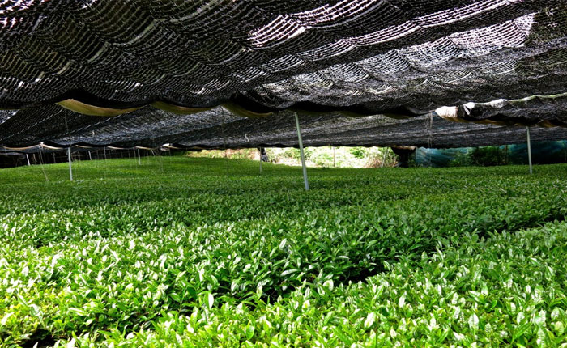

## Чай Матча — что это за напиток и какой он на вкус

За 3 месяца до сбора урожая кусты намеренно затеняют от солнца, чтобы растение насыщалось влагой, полезными микроэлементами из почвы. Благодаря этому, в нем накапливается много ценных веществ:

- Хлорофилл (именно он придает листьям яркий зеленый цвет);
- антиоксиданты катехины (их в 3 раза больше, чем в обычном чае);
- аминокислота L-теанин, обладающая защитой от стрессов. Его даже пьют буддийские монахи перед медитацией;
- бета каротин (его количество в 9 раз больше, чем в шпинате);
и др.

Такой метод выращивания также влияет на терпкость — чем дольше растение находится на солнце, тем вкус чая будет горче. Поэтому у настоящего Матчи почти нет горечи.

Листья перетирают в каменных жерновах вручную или с помощью автоматизированного процесса. Такой способ позволяет обрабатывать сырье без нагрева и ферментации. За один час ручной работы получается всего лишь 20 гр смеси.

Матча обладает высокой концентрацией и насыщенностью, одна порция равноценна 10-15 чашкам обычного зеленого чая. Поэтому пьют его понемногу.

В составе содержит большое количество витаминов, масел, аминокислот. Листья растираются в мелкую пудру, которая при заваривании полностью растворяется. Все ценные вещества поступают в организм. Чтобы максимально сохранить их пользу, воду для приготовления нельзя доводить до кипения.

Сырье делят на 3 основных класса: самый лучший используется для проведения чайных церемоний, остальные — для приготовления различных напитков, десертов.

Если вы никогда не пили Маттю, с первого раза он вам точно не понравится. Кому-то он напоминает лекарство, а кому-то болотную траву. Но со временем вы начнете различать натуральные природные нотки.

Чтобы привыкнуть к необычному вкусу, рекомендуют поначалу разбавлять растительным молоком. Рецепт Латте вы найдете далее в статье.

## Польза и вред чая Матча для организма (противопоказания)

Этот эликсир нужно пить, осознавая всю пользу, которую он несет для организма. Два основных оздоравливающих свойства — очищение и ощелачивание. От них зависит качество жизни, а также крепкое здоровье без болезней.

### Польза

1. Снижает риск появления злокачественных новообразований благодаря наличию в составе большого количества антиоксидантов, которые называются «катехины». Они содержатся только в зеленом чае, их количество в одной порции Матча больше в 4 раза, чем в обычном напитке.

2. Обладает удивительным балансирующим эффектом из-за сочетания аминокислоты L-тианина и кофеина. Ваш мозг расслабляется, вы ощущаете спокойствие. Но при этом не засыпаете, а наоборот — бодры и максимально сконцентрированы. Особенно помогает при выполнении рутинной, однообразной работы, не вызывая зависимости, как кофе.

3. Улучшает метаболизм и снимает тяжесть в желудке. Ускоряет сжигание калорий в 4 раза быстрее, чем обычно. Однако его нельзя пить натощак, так как вызывает еще большее ощущение голода.

4. Насыщен хлорофиллом, который очищает от токсинов, выводит тяжелые металлы из организма. Кроме этого, обогащает кровь кислородом, понижает ее кислотность.

5. Защищает от атеросклероза, предохраняя липопротеины (т.н. холестерин) от окисления.

6. Снижает риск заболевания диабетом 2-го типа, уменьшая концентрацию сахара в крови.

## Вред

Противопоказаний у него нет при соблюдении рекомендованной нормы. Однако, необходимо выделить два важных момента:

1. Индивидуальная непереносимость каких-либо веществ, присутствующих в напитке.

2. Нельзя употреблять за 3-4 часа до сна, так как он сильно бодрит и тонизирует. Иначе бессонница вам обеспечена.

**Сколько чашек в день можно**

Пить зелье можно как ежедневно, так периодически курсом в несколько дней. В день рекомендуется не более двух порций: с утра для бодрости, после обеда для очищения мыслей и концентрации внимания.

## Как правильно заваривать и пить Матчу дома классическим способом

В японской традиционной чайной церемонии существует два рецепта: насыщенный «Койтя» — больше порошка — меньше воды, а также мягкий «Усутя» — меньше смеси — больше жидкости.

Доводится до нужной консистенции специальным венчиком, сделанным из бамбука. Он не позволяет окисляться полезным веществам, содержащимся в листе. Превращает зеленую пудру в однородную массу, создавая густую ароматную пену.

Вкус чая немного горький, поэтому его принято подавать с японскими сладостями «Вагаси», сделанными из натуральных компонентов. В них низкое содержание калорий, они полезны для организма.

Для приготовления напитка используются такие составляющие:

- Матча высшего сорта.
- Бамбуковый венчик «Часен».
- Керамическая пиала «Тяван».
- Мелкое сито.
- Бамбуковая ложечка «Тясаку» (1 черпак = 1 гр порошка).

**Рецепт мягкого, менее насыщенного «Усутя»:**

1. Нагрейте воду до температуры 70°-80°, но не кипятите.

2. Горячую жидкость налейте в пиалу до половины, чтобы она прогрелась.

3. Смочите в ней венчик, окунув и подержав некоторое время. После того, как чаша станет теплой, слейте жидкость. Бумажной салфеткой промокните насухо.

4. Отмерьте 2 гр порошка (чайная ложка без горки), просейте его через ситечко, а оставшиеся комочки разотрите ложечкой.

5. Залейте пудру 70 мл горячей воды (не более 80°). Опустите венчик на дно, медленно круговыми движениями размешайте смесь. Затем быстрыми движениями вверх-вниз взбейте до исчезновения пузырьков и появления пены.

Готовый напиток можно пить прямо из пиалы, при желании перелейте в кофейную чашечку. Подается без добавления молока и сахара.

**Для крепкого «Койтя»** в пиалу просейте 4 гр матчи, затем влейте 50 мл горячей жидкости. Так как масса получается более густой, взбивать ее нужно неторопливо. Венчик вращайте поочередно то в одну, то в другую сторону. Консистенция должна напоминать растопленный шоколад.

В Японии во время чайной церемонии его выпивают тремя глотками. Чашу при этом ставят на ладонь, а второй придерживают. В процессе питья принято любоваться красотой посуды, при этом благодарить природу за целительный напиток.

Хранить баночку необходимо плотно закрытой, в холодильнике при температуре 5-10°. Смесь не рекомендуется пересыпать в другую емкость. Срок хранения после вскрытия составляет 1 месяц.

Источник: 
[сайт Жилье мое](https://zhile-moe.ru/chaj-matcha/)

